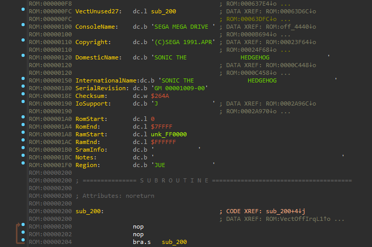
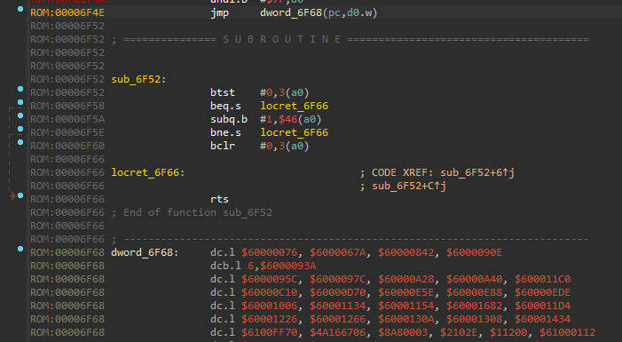
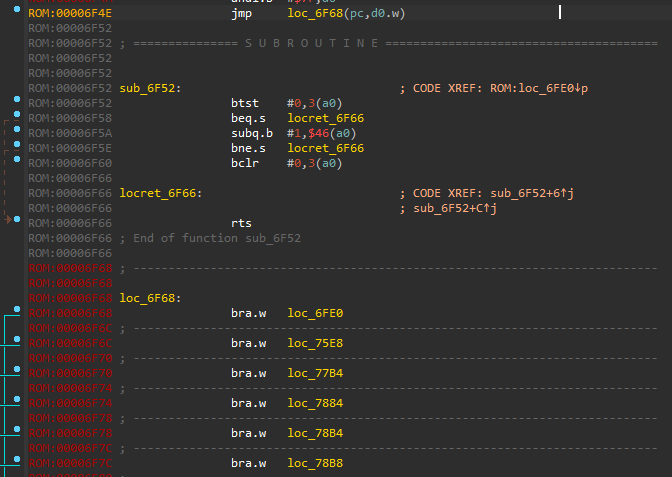

# ida-genesis

## Description

This project consists of a suite of IDA scripts that assist in SEGA Genesis ROM hacking.

## SEGA Genesis ROM Loader

`sg_smd.py` is a IDA SEGA Genesis ROM loader. To use it, move it to your IDA `loaders` directory and load a ROM.

[]

## Branch Table Enumeration

`pcr-branch-table.py` is a IDA script that locates and disassembles a specific branch table pattern that auto-analysis
sometimes misses. The pattern consists of a PC-relative branch to a instruction in the table that in turn, branches
to another routine.

After auto-analysis:

[]

After running `pcr-branch-table`:

[]
